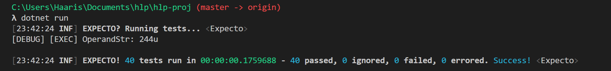

# HLP Individual Project
## Introduction
This repo contains fsharp source files to run and test a part of the ARM simulator. The code has been modularised and the main working module is `Memory` which can be found in `Program.fs` in the root directory.

## Module Description
### Main Functions
The module currently implements two main functions: `parse` and `execute`. It can be used in conjuction with top-level code to parse recognizable memory instructions (see below for more info) into an `Memory.Instr` record type which can then be used by the `execute` function to simulate an ARM processor.

### Entrypoints

1. `parse` 
    - Input : `LineData` record which seperates opcodes, suffixes, conditions and operands as different string or d.u. types  
    - Output : `Result<Parse<Instr>,string> option` which is a monadic value option type of value. 
        - `None` signifies none of the opcodes present are recognizable by the parse function
        - `Some(_)` signifies that the opcode present was recognizable by the parse function but the result type must determine whether     parse was successful
        - After extracting the option, `Parse<Instr>` can be extracted if parse was successful. This contains recognized intruction records that are valid atleast in their format and general order.
        - If there is an error, the object wrapped by some will contain an `Error<string>` to promt the user.
        - Using monad types execution is not stalled at any stage and instead errors are propagated through the pipeline.

2. `execute` 
    - Input: `Parse<Instr>` `MachineMemory<Instr>` `DataPath`  
    - Output: `Result<(MachineMemory<Instr> * DataPath), string>`
    - This uses the machinememory map and datapath provided to execute an instruction which is similar to simulating the instruction. The resulting output is either an error with a string describing an error or a successful execute with modified machine memory and datapath objects.

### Supported Commands (OPC)
1. LDR
2. LDRB
3. STR

### Formats

| Type | Operand1 | Operand2 | Operand3 | Format Example         |
| ---- | -------- | -------- | -------- | ---------------------- |
| A    | REG1     | REG2     | -        | OPC REG1, [REG2]       |
| B    | REG      | REG      | REG      | OPC REG1, [REG2, REG3] |
| C    | REG      | REG      | REG      | OPC REG, [REG, REG3]!  |
| D    | REG      | REG      | REG      | OPC REG, [REG], REG3   |
| B    | REG      | REG      | LIT      | OPC REG1, [REG2, LIT]  |
| C    | REG      | REG      | LIT      | OPC REG, [REG, LIT]!   |
| D    | REG      | REG      | LIT      | OPC REG, [REG], LIT    |

#### Type Definitions
1. A simply load/store from/to REG1 and the memory index given by REG2. If it is an LDERB instruction then, any valid address is accepted, however if the suffix B is not used then the address given must be divisible by 4 otherwise errors will be thrown

## Tests
- All tests can be found in the file `Test.fs`. To access these tests, simply run the command `dotnet run` at the root directory of the folder.
- Currently, only unit tests are implemented due to time limitations.
- There are currently 40 tests and all pass as shown in the screenshot below.

